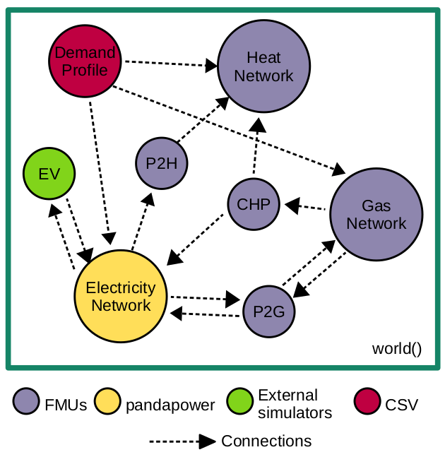

---
hide:
  - navigation
---

# energysim documentation

**Compatible with Python 3.8 and above.**



## What is energysim?

`energysim` is a Python-based co-simulation tool designed to simplify
multi-energy co-simulations. The tool was originally called `FMUWorld`,
since it focussed exclusively on combining Functional Mockup Units (FMUs).
It has since evolved into a general-purpose co-simulation coordinator that
supports a wide variety of energy-system simulators.

The idea behind `energysim` is to let users focus on high-level
applications — energy-system planning, control-strategy evaluation,
sector coupling — while the framework handles low-level tasks such as
message exchange, time-step coordination, dependency ordering, and
algebraic-loop detection.

Currently, `energysim` allows users to combine:

1. Dynamic models packaged as **Functional Mockup Units** (FMI 1.0 & 2.0, Co-Simulation and Model Exchange).
2. **Pandapower** networks (PF, DCPF, OPF, DCOPF).
3. **PyPSA** networks *(experimental)*.
4. User-defined **external simulators** written in Python.
5. **CSV** data files (time-indexed profiles).
6. **DIgSILENT PowerFactory** models via the Python API.
7. **MATLAB / GNU Octave** models as `.m` functions.
8. **Signal generators** (Python lambda / function).
9. Standalone **Python scripts**.

---

## Installation

=== "pip"

    ```bash
    pip install energysim
    ```

=== "uv"

    ```bash
    uv add energysim
    ```

To install with all optional dependencies:

=== "pip"

    ```bash
    pip install energysim[all]
    ```

=== "uv"

    ```bash
    uv add energysim[all]
    ```

### Dependencies

**Core** (always required):

| Package   | Purpose                              |
|-----------|--------------------------------------|
| NumPy     | Array operations                     |
| Pandas    | DataFrames for results               |
| NetworkX  | Dependency graph & topological sort  |
| tqdm      | Progress bar                         |
| PyTables  | HDF5 results storage                 |

**Optional** (installed lazily when the first simulator of that type is added):

| Package        | When needed                              | Install extra            |
|----------------|------------------------------------------|--------------------------|
| FMPy           | FMU simulators                           | `energysim[fmu]`         |
| pandapower     | Powerflow simulators                     | `energysim[powerflow]`   |
| PyPSA          | PyPSA network simulators                 | `energysim[pypsa]`       |
| Matplotlib     | Plotting                                 | `energysim[plotting]`    |
| oct2py         | MATLAB/Octave models (Octave backend)    | —                        |
| MATLAB Engine  | MATLAB/Octave models (MATLAB backend)    | —                        |
| Plotly         | Interactive HTML dashboards              | —                        |

---

## Usage

`energysim` is designed for a plug-and-play workflow. The main
component is the `world` object — the coordinator where all simulators,
connections, and options are registered:

```python
from energysim import world
```

### Initialization

Create a `world` with the basic simulation parameters:

```python
my_world = world(
    start_time=0,
    stop_time=86400,
    t_macro=900,
    logging=True,
    coupling='jacobi',
    extrapolation='zero-order',
)
```

`world()` accepts the following parameters:

| Parameter                | Default          | Description                                                                                       |
|--------------------------|------------------|---------------------------------------------------------------------------------------------------|
| `start_time`             | `0`              | Simulation start time in seconds.                                                                 |
| `stop_time`              | `1000`           | Simulation stop time in seconds.                                                                  |
| `t_macro`                | `60`             | Macro time-step — interval at which variables are exchanged between simulators.                    |
| `logging`                | `False`          | Toggle simulation progress updates.                                                               |
| `res_filename`           | `'es_res.h5'`    | HDF5 results file name.                                                                          |
| `coupling`               | `'jacobi'`       | Coupling strategy: `'jacobi'`, `'gauss-seidel'`, or `'iterative'`.                               |
| `extrapolation`          | `'zero-order'`   | Extrapolation method: `'zero-order'` or `'linear'`.                                              |
| `max_iterations`         | `10`             | Max fixed-point iterations per macro step (iterative coupling only).                              |
| `convergence_tolerance`  | `1e-6`           | Relative tolerance for convergence check (iterative coupling only).                               |

See [Architecture](architecture.md) for a detailed explanation of each coupling mode.

### Adding simulators

Simulators are added using `add_simulator()`:

```python
my_world.add_simulator(
    sim_type='fmu',
    sim_name='plant',
    sim_loc='model.fmu',
    inputs=['power_cmd'],
    outputs=['temperature'],
    step_size=1,
)
```

Parameters:

- **`sim_type`** — one of `'fmu'`, `'powerflow'`, `'csv'`, `'external'`, `'powerfactory'`, `'matlab'`, `'script'`.
- **`sim_name`** — unique identifier used in connections and results.
- **`sim_loc`** — path to the model or data file.
- **`inputs`** — list of input variable names (populated via connections).
- **`outputs`** — list of output variable names to record.
- **`step_size`** — micro time-step in seconds (default `1`).

See [Adding Simulators](add-simulator.md) for the full reference for each simulator type.

Signals can be added with a dedicated method:

```python
my_world.add_signal(
    sim_name='setpoint',
    signal=lambda t: [42.0],
    step_size=1,
)
```

### Connections between simulators

Once all simulators are added, their connections are specified with a
dictionary mapping source outputs to destination inputs:

```python
connections = {
    'weather.temperature':  'building.T_ambient',
    'weather.irradiance':   'pv.G_solar',
    'pv.P_dc':              'grid.PV.p_mw',
    'controller.p_cmd':     ('battery.P_cmd', 'grid.Battery.p_mw'),
}
my_world.add_connections(connections)
```

`add_connections()` performs **automatic validation**:

- **Simulator existence** — raises `ConnectionError` if a referenced simulator name is not registered.
- **Malformed variable strings** — raises `ConnectionError` if a variable string does not contain a `.` separator.
- **Read-only targets** — warns if a connection writes to a CSV or signal simulator (which are inherently read-only).
- **Variable name checking** — warns if a variable name does not match the adapter's known variables (when introspection is available).

After validation, `energysim` builds a **dependency graph** from the
connections and computes a **topological execution order**. If the graph
contains cycles (algebraic loops), a warning is issued and the cyclic
simulators are grouped using strongly-connected-component analysis.

#### Fan-out and fan-in

A single output can drive multiple inputs (fan-out):

```python
connections = {
    'source.y': ('sim_a.x', 'sim_b.x'),
}
```

Multiple outputs can feed a single input (fan-in); the last value wins:

```python
connections = {
    ('source_a.y', 'source_b.y'): 'sim_c.x',
}
```

### Initializing simulator variables

To set initial values before the first time-step, provide an `init`
dictionary via `options()`:

```python
initializations = {
    'plant':   (['temperature'], [293.15]),
    'battery': (['SoC'],         [0.5]),
}
my_world.options({'init': initializations})
```

### Executing simulation

Run the co-simulation by calling `simulate()`:

```python
my_world.simulate(pbar=True)
```

The `pbar` flag toggles the `tqdm` progress bar.

During simulation, `energysim`:

1. Initialises all adapters (`adapter.init()`).
2. For each macro time-step:
    1. Exchanges variables according to the coupling strategy.
    2. Steps each simulator from *t* to *t + t_macro*.
    3. Records outputs to the HDF5 file.
3. Cleans up all adapters (`adapter.cleanup()`).

### Extracting results

After simulation, retrieve results as a dictionary of DataFrames:

```python
results = my_world.results(to_csv=True)
```

Options:

- `to_csv=True` — also export each simulator's results to a CSV file.
- `dashboard=True` — open an interactive HTML dashboard in the browser.
- `dashboard_path='my_dashboard.html'` — save the dashboard to a custom path.

---

## Error handling

`energysim` uses a structured exception hierarchy instead of
`sys.exit()` calls:

| Exception                          | Description                                          |
|------------------------------------|------------------------------------------------------|
| `EnergysimError`                   | Base class for all energysim exceptions.             |
| `SimulatorVariableError`           | Invalid variable name or type.                       |
| `SimulatorElementNotFoundError`    | Element not found in a network.                      |
| `ConnectionError`                  | Malformed or invalid connection specification.       |

All exceptions can be imported from `energysim.base`:

```python
from energysim.base import (
    EnergysimError,
    SimulatorVariableError,
    SimulatorElementNotFoundError,
    ConnectionError,
)
```
